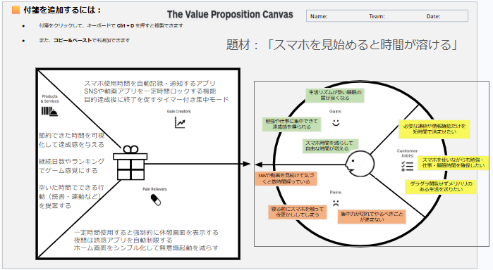

# Value Proposition Canvas (VPC) v1

## 1. 顧客のセグメント (Customer Profile)

### 顧客の仕事 (Customer Jobs)
* 必要な連絡や情報確認だけを短時間で済ませたい
* スマホを使いながらも勉強・仕事・睡眠時間を確保したい
* ダラダラ閲覧せずメリハリのある生活を送りたい

### 悩み (Pains)
* SNSや動画を見続けて気づくと数時間経っている
* 寝る前にスマホを触って夜更かししてしまう
* 集中力が切れてやるべきことが進まない

### 利得 (Gains)
* 勉強や仕事に集中できて達成感を得られる
* スマホ時間を減らして自由な時間が増える
* 生活リズムが整い睡眠の質が良くなる

---

## 2. 提供価値 (Value Map)

### 製品・サービス (Products & Services)
* スマホ使用時間を自動記録・通知するアプリ
* SNSや動画アプリを一定時間ロックする機能
* 目的達成後に終了を促すタイマー付き集中モード

### 悩みの解消 (Pain Relievers)
* 一定時間使用すると強制的に休憩画面を表示する
* 夜間は誘惑アプリを自動制限する
* ホーム画面をシンプル化して無意識起動を減らす
* 空いた時間でできる行動（読書・運動など）を提案する

### 利得の創出 (Gain Creators)
* 節約できた時間を可視化して達成感を与える
* 継続日数やランキングでゲーム感覚にする
* 空いた時間でできる行動（読書・運動など）を提案する
